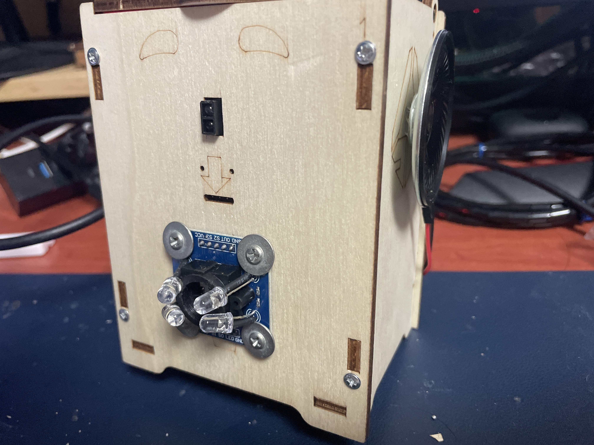

# Smart Trash Bottle · 스마트 분리수거 쓰레기통

> Arduino Nano 기반의 색상 인식 자동 분리수거 쓰레기통  
> 쓰레기를 가져다 대면 색상을 감지해 종류를 음성으로 안내하고 뚜껑이 자동으로 열립니다.

<p align="center">
  
</p>

---

## 동작 원리

1. **IR 센서**가 손/쓰레기의 접근을 감지
2. **TCS3200 색상 센서**로 쓰레기 색상을 판별
   - 빨강 → 🥫 **캔** (0001.mp3 재생)
   - 파랑 → 🍶 **병** (0002.mp3 재생)
   - 초록 → 🧴 **플라스틱** (0003.mp3 재생)
3. **DFPlayer Mini**가 분리수거 종류를 음성으로 안내
4. **서보모터**가 뚜껑을 부드럽게 열고 5초 후 자동 닫힘

---

## 하드웨어 구성

| 부품 | 역할 |
|------|------|
| Arduino Nano | 메인 제어 |
| TCS3200 색상 센서 | 쓰레기 색상 감지 |
| IR 근접 센서 | 물체(손) 접근 감지 |
| 서보모터 (SG90) | 뚜껑 자동 개폐 |
| DFPlayer Mini | MP3 음성 재생 |
| 스피커 (8Ω) | 음성 출력 |
| Micro SD 카드 | 음성 파일 저장 |
| 레이저 커팅 목재 케이스 | 외관 |

---

## 핀 연결 (Arduino Nano)

| 핀 | 연결 부품 |
|----|-----------|
| D2 | DFPlayer Mini TX |
| D3 | DFPlayer Mini RX |
| D4 | TCS3200 S0 |
| D5 | TCS3200 S1 |
| D6 | TCS3200 S2 |
| D7 | TCS3200 S3 |
| D8 | TCS3200 OUT |
| D9 | TCS3200 LED |
| D10 | 서보모터 신호선 |
| D11 | IR 센서 출력 |

---

## SD 카드 파일 구성

SD 카드 루트 디렉토리에 아래 파일을 저장합니다.

```
/
├── 0001.mp3   ← "캔입니다"
├── 0002.mp3   ← "병입니다"
└── 0003.mp3   ← "플라스틱입니다"
```

---

## 사용 라이브러리

- [DFMiniMp3 (Makuna)](https://github.com/Makuna/DFMiniMp3) — DFPlayer Mini 제어
- [Servo](https://www.arduino.cc/reference/en/libraries/servo/) — 서보모터 제어
- SoftwareSerial (Arduino 기본 내장)

Arduino IDE의 **라이브러리 관리자**에서 `DFMiniMp3`를 검색해 설치하세요.

---

## 시리얼 명령어 (디버그용)

Arduino IDE 시리얼 모니터(9600 baud)에서 아래 키를 입력하면 각 기능을 테스트할 수 있습니다.

| 키 | 기능 |
|----|------|
| `t` | 서보모터 열고 닫기 테스트 |
| `i` | IR 센서 10초 모니터링 |
| `1` / `2` / `3` | 해당 트랙 수동 재생 |
| `+` / `-` | 볼륨 증가 / 감소 |
| `s` | 현재 상태 출력 |

---

## 업로드 방법

1. Arduino IDE를 열고 `SmartTrashBottle.ino`를 불러옵니다.
2. 보드: **Arduino Nano**, 프로세서: **ATmega328P** 선택
3. 포트 선택 후 업로드

---

## 색상 감지 알고리즘

TCS3200은 색상을 **주파수(펄스 폭)** 로 출력합니다.  
해당 색상의 필터에서 반사량이 많을수록 주파수가 낮아집니다.

```
빨강: R 주파수 < G, B (R이 가장 낮음)
초록: G 주파수 < R, B
파랑: B 주파수 < R, G
```

각 채널 간 차이값이 10 미만이면 "알 수 없음"으로 판단해 뚜껑을 열지 않습니다.
